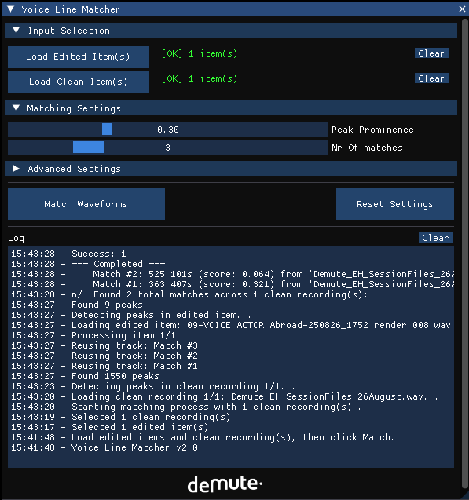

# Waveform Matcher
---

## Installation:
---
Reapack
1. Download and install Reapack for your platform here(also the user Guide): [Reapack Download](https://reapack.com/user-guide#installation)
2. go to Extensions->Reapack->Import Repositories paste the following link:

--> https://raw.githubusercontent.com/DemuteStudio/Waveform-Matcher/main/index.xml

Manual:
1. Download or clone the repository.
2. Add compareWaveform.lua as a new action in reaper, make sure the scripts folder is in the same location as compareWaveform.lua.

The **Waveform Matcher** is a REAPER tool that automatically matches similar voice recordings from different media items using peak detection analysis.

## Why Use This Tool?

When doing remote voice recording (e.g., via SessionLink), you may work with two versions of the same audio:
- **Remote recording** - already edited during the recording session but contains artifacts, compression, or quality issues
- **Clean local recording** - Long uninterupted voice recording, high quality but unedited recorded localy by the voice actor.

Manually finding and matching each edited segment in the clean recording is time-consuming and error-prone. The Waveform Matcher automates this process, saving hours of work.

## How It Works

### Peak Detection Analysis

The Waveform Matcher uses a **peak-to-peak pattern matching** algorithm that compares the transient characteristics of audio waveforms:

1. **Peak Detection**: The tool identifies prominent amplitude peaks in both the edited and clean recordings
2. **Pattern Extraction**: For each peak, it analyzes the temporal pattern of surrounding peaks
3. **Pattern Matching**: The edited peak pattern is compared against every possible position in the clean file
4. **Scoring**: Matches are scored based on:
   - **Peak timing accuracy** - How closely peak positions align
   - **Relative distances** - The intervals between consecutive peaks
   - **Amplitude similarity** - The relative loudness of matched peaks
   - **Envelope matching** - Overall loudness contours

## Accuracy & Limitations

Based on extensive testing across various recording conditions:

### Accuracy Rates

| Item Duration | Accuracy | Notes |
|---------------|----------|-------|
| **> 4 seconds (long items)** | ~95% | Reliable even with heavily distorted or compressed audio |
| **< 4 seconds (short items)** | ~80% | Depends on source context availability, If the item has more source content it will automaticaly extend and recrop the item to improve accuracy |

The tool is quite resiliant against Network Latency, artifacts and background noise, but big differences in timing or cuts will decrease the accuracy.
### Limitations

- **Very short clips** without extra source content may not have enough peaks for reliable matching
- **Edited audio** with rearranged glued audio won't match correctly
- **Multiple very similar takes** may cause ambiguous matches - review results manually

**Tips:**
- **Multiple matches per item** - The tool creates several match candidates ranked by score. This lets you choose the best one manually.
- **Watch the log** - Error messages and match scores appear in the bottom panel
## How to use the Waveform Matcher
---

1. Import your **clean recordings** and **edited files** into REAPER on separate tracks
2. Run the Waveform Matcher action from REAPER's action list
3. **Load Edited Items**
   - Select the edited item(s) in REAPER
   - Click **"Load Edited Item(s)"** in the Waveform Matcher GUI
4. **Load Clean Items**
   - Select the clean recording(s) in REAPER
   - Click **"Load Clean Item(s)"** in the Waveform Matcher GUI
5. **Configure Settings** *(optional)*
   - **Peak Prominence** - Lower values detect more peaks (default: 0.3)
   - **Number of Matches** - How many match candidates to create per edited item (default: 3)
   - **Advanced Settings** - Fine-tune detection parameters if needed
6. **Run Matching**
   - Click **"Match Waveforms"**
   - Monitor progress in the real-time progress bar
   - Review log messages for details and potential errors
7. **Verify Results**
   - Matched items are created on new tracks below the edited track
   - Listen to matches and verify they align correctly
   - Keep the best match and delete others
